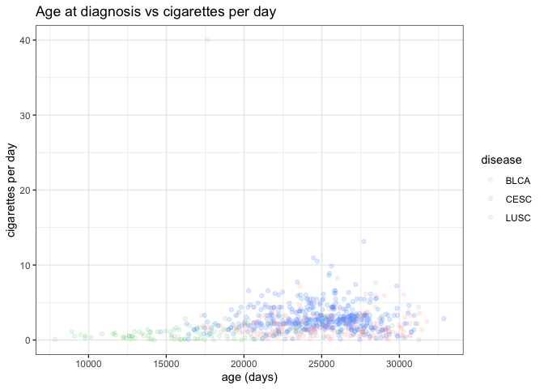
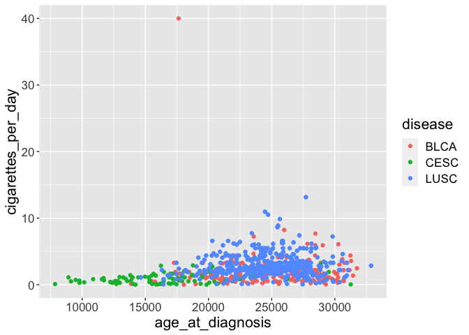
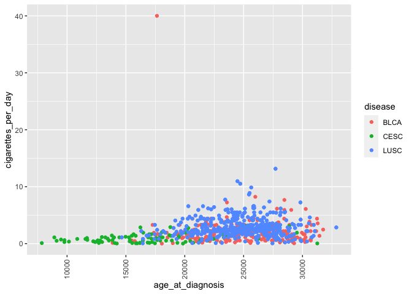
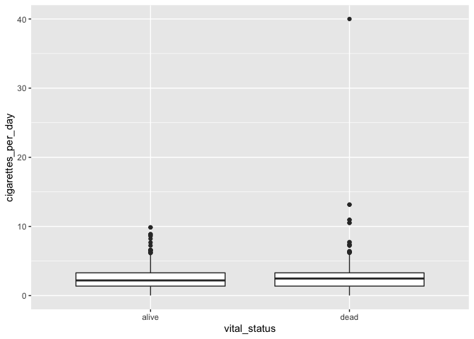
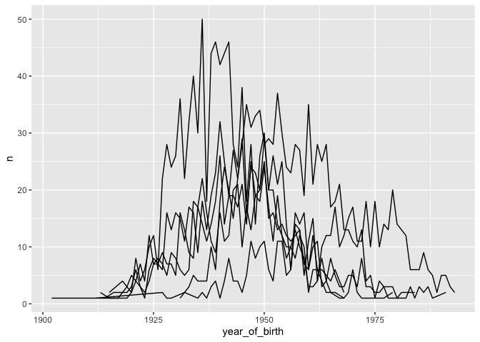
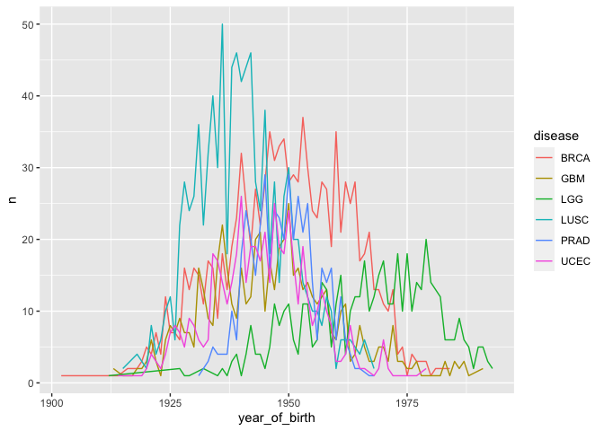
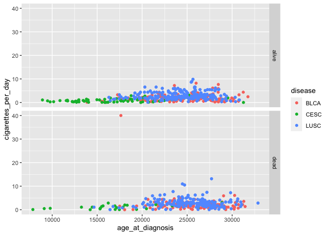
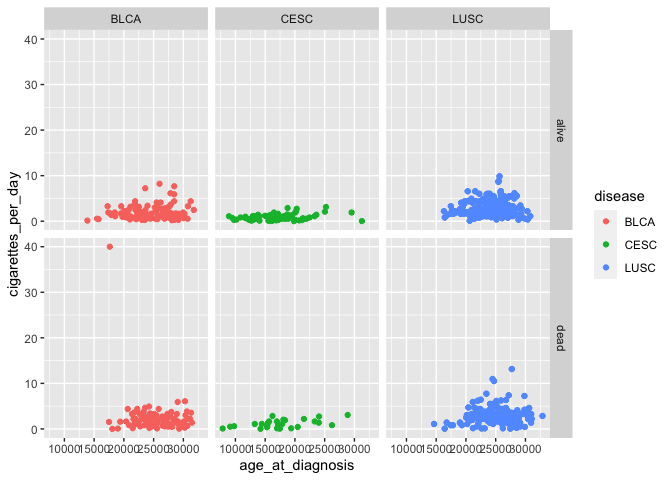

Week 4: Data Visualization
================

<!--week4.md is generated from week4.Rmd. Please edit that file -->

## Objectives

So far in this course, we have:

  - learned basic R syntax, including working with objects and functions
  - imported data into R for manipulation with base R methods
  - loaded `tidyverse` and used its data science tools to manipulate and
    filter data

This last week’s material continues our explorations of tidyverse with a
specific focus on data visualization. After completing this material,
you should be able to use `ggplot2` in R to:

  - create and modify scatterplots and boxplots
  - represent time series data as line plots
  - split figures into multiple panels
  - customize your plots

## Getting set up

Since we are continuing to work with data in `tidyverse`, we need to
make sure all of our data and packages are available for use.

Open your project in RStudio. Create a new script called `week4.R`, add
a title, and enter the following code with comments:

``` r
# load library
library(tidyverse)
```

    ## ── Attaching packages ────────────────────────────────────────────── tidyverse 1.3.0 ──

    ## ✓ ggplot2 3.2.1     ✓ purrr   0.3.3
    ## ✓ tibble  2.1.3     ✓ dplyr   0.8.3
    ## ✓ tidyr   1.0.0     ✓ stringr 1.4.0
    ## ✓ readr   1.3.1     ✓ forcats 0.4.0

    ## ── Conflicts ───────────────────────────────────────────────── tidyverse_conflicts() ──
    ## x dplyr::filter() masks stats::filter()
    ## x dplyr::lag()    masks stats::lag()

``` r
# read in first filtered data from last week
birth_reduced <- read_csv("data/birth_reduced.csv")
```

    ## Parsed with column specification:
    ## cols(
    ##   .default = col_character(),
    ##   age_at_diagnosis = col_double(),
    ##   days_to_death = col_double(),
    ##   days_to_birth = col_double(),
    ##   days_to_last_follow_up = col_double(),
    ##   cigarettes_per_day = col_double(),
    ##   years_smoked = col_double(),
    ##   year_of_birth = col_double(),
    ##   year_of_death = col_double()
    ## )

    ## See spec(...) for full column specifications.

``` r
# read in second filtered data from last week
smoke_complete <- read_csv("data/smoke_complete.csv")
```

    ## Parsed with column specification:
    ## cols(
    ##   .default = col_character(),
    ##   age_at_diagnosis = col_double(),
    ##   days_to_death = col_double(),
    ##   days_to_birth = col_double(),
    ##   days_to_last_follow_up = col_double(),
    ##   cigarettes_per_day = col_double(),
    ##   years_smoked = col_double(),
    ##   year_of_birth = col_double(),
    ##   year_of_death = col_double()
    ## )
    ## See spec(...) for full column specifications.

If you have trouble accessing your data and see an error indicating the
file is not found, it is likely one of the following problems:

1.  Check to make sure your project is open in RStudio. You should see
    the path to your project directory (e.g., `~/Desktop/introR`) appear
    at the top of the console (above the window showing output). If this
    doesn’t appear, you should save your script in your project
    directory, then go to `File -> Open Project`. Navigate to the
    location of your project directory and open the folder, then try to
    reexecute your code.
2.  Make sure you have the two datasets (`birth_reduced.csv` and
    `smoke_complete.csv`) in your `data` directory. Please reference the
    materials from week 3 to filter the original clinical dataset and
    export these data.

Once your data are imported appropriately, we can create a quick plot:

``` r
# simple plot from base R from the smoke_complete dataset
plot(x=smoke_complete$age_at_diagnosis, y=smoke_complete$cigarettes_per_day)
```

<!-- -->

This plot is from base R. It gives you a general idea about the data,
but isn’t very aesthetically pleasing. Our work today will focus on
developing more refined plots using `ggplot2`, which is part of the
`tidyverse`.

## Intro to ggplot2 and scatterplots

There are three steps to creating a ggplot. We’ll start with a
scatterplot, which is used to compare quantitative (continuous)
variables.

1.  bind data: create a new plot with a designated dataset

<!-- end list -->

``` r
# basic ggplot
ggplot(data = smoke_complete) # bind data to plot
```

<!-- -->

The last line of code creates an empty plot, since we didn’t include any
instructions for how to present the data.

2.  specify the aesthetic: maps the data to axes on a plot

<!-- end list -->

``` r
# basic ggplot
ggplot(data = smoke_complete, aes(x = age_at_diagnosis, 
                           y = cigarettes_per_day)) # specify aesthetics (axes)
```

<!-- -->

This adds labels to the axis, but no data appear because we haven’t
specified how they should be represented

3.  add layers: visual representation of plot, including ways through
    which data are represented (geometries or shapes) and themes
    (anything not the data, like fonts)

<!-- end list -->

``` r
ggplot(data = smoke_complete,
       mapping = aes(x = age_at_diagnosis, y = cigarettes_per_day)) + 
  geom_point() # add a layer of geometry
```

<!-- -->

The plus sign (`+`) is used here to connect parts of `ggplot` code
together. The line breaks and indentation used here represents the
convention for `ggplot`, which makes the code more readible and easy to
modify.

In the code above, note that we don’t need to include the labels for
`data =` and `mapping =`. It’s also common to include the mapping
(`aes`) in the `geom`, which allows for more flexibility in customizing
(we’ll get to this later\!).

``` r
ggplot(smoke_complete) + 
  geom_point(aes(x = age_at_diagnosis, y = cigarettes_per_day)) 
```

<!-- -->

This plot is identical to the previous plot, despite the differences in
code.

## Customizing plots

Now that we have the data generally displayed the way we’d like, we can
start to customize a plot.

``` r
# add transparency with alpha
ggplot(smoke_complete) +
  geom_point(aes(x = age_at_diagnosis, y = cigarettes_per_day), alpha = 0.1)
```

<!-- -->

Transparency is useful to help see the distribution of data, especially
when points are overlapping.

``` r
# change color of points
ggplot(smoke_complete) +
  geom_point(aes(x = age_at_diagnosis, y = cigarettes_per_day), alpha = 0.1, color = "green")
```

<!-- -->

For more information on colors available, look
[here](http://sape.inf.usi.ch/quick-reference/ggplot2/colour).

We can also color points based on another (usually categorical)
variable:

``` r
ggplot(smoke_complete) +
  geom_point(aes(x = age_at_diagnosis, y = cigarettes_per_day, color = disease), alpha = 0.1)
```

<!-- -->

This automatically adds a legend as well. Why don’t we need to include
quotation marks around `disease`?

We can also change the general appearance of the plot (background colors
and fonts):

``` r
# change background theme
ggplot(smoke_complete) +
  geom_point(aes(x = age_at_diagnosis, y = cigarettes_per_day, color = disease), alpha = 0.1) +
  theme_bw()
```

<!-- -->

This adds another layer to our plot representing a black and white
theme. A complete list of pre-set themes is available
[here](https://ggplot2.tidyverse.org/reference/ggtheme.html), and we’ll
cover ways to customize our own themes later in this lesson.

While the axes are currently sufficient, they aren’t particularly
attractive. We can add a title and replace the axis labels using `labs`:

``` r
# add title and custom axis labels
ggplot(smoke_complete) +
  geom_point(aes(x = age_at_diagnosis, y = cigarettes_per_day, color = disease), alpha = 0.1) +
  labs(title = "Age at diagnosis vs cigarettes per day", # title
       x="age (days)", # x axis label
       y="cigarettes per day") +# y axis label
  theme_bw()
```

<!-- -->

Another common feature to customize involves the orientation and
appearance of fonts. While this can be controlled by default themes like
`theme_bw)`, you can also control different parts independently. For
example, we can make a dramatic modification to all text in the plot:

``` r
ggplot(smoke_complete) +
  geom_point(aes(x = age_at_diagnosis, y = cigarettes_per_day, color = disease)) +
  theme(text = element_text(size = 16)) # increase all font size
```

<!-- -->

Alternative, you can alter only one specific type of text:

``` r
ggplot(smoke_complete) +
  geom_point(aes(x = age_at_diagnosis, y = cigarettes_per_day, color = disease)) +
  theme(axis.text.x = element_text(angle = 90, hjust = 0.5, vjust = 0.5)) # rotate and adjust x axis text
```

<!-- --> This rotates and
adjusts the horizontal and vertical arrangement of the labels on only
the x axis. Of course, you can also modify other text (y axis, axis
labels, legend).

After you’re satisfied with a plot, it’s likely you’d want to share it
with other people or include in a manuscript or report.

``` r
# create directory for output
dir.create("figures")
```

``` r
# save plot to file
ggsave("figures/awesomePlot.jpg", width = 10, height = 10, dpi = 300)
```

This automatically saves the last plot for which code was executed. You
can view your `figures/` directory to see the exported jpeg file. This
command interprets the file format for export using the file suffix you
specify. The other arguments dictate the size (`width` and `height`) and
resolution (`dpi`).

**Challenge:** Create a scatterplot showing age at diagnosis vs years
smoked with points colored by gender and appropriate axis labels
(solutions to Challenge exercises are available
[here](https://github.com/fredhutchio/R_intro/blob/master/solutions/week4_solutions.R))

## Box and whisker plots

Box and whisker plots compare the distribution of a quantitative
variable among categories.

``` r
# creating a box and whisker plot
ggplot(smoke_complete) +
  geom_boxplot(aes(x = vital_status, y = cigarettes_per_day))
```

<!-- -->

The main differences from the scatterplots we created earlier are the
`geom` type and the variables plotted.

We can change the color similarly to scatterplots:

``` r
# adding color
ggplot(smoke_complete,
       aes(x = vital_status, y = cigarettes_per_day)) +
  geom_boxplot(aes(x = vital_status, y = cigarettes_per_day), color = "tomato")
```

<!-- -->

It seems weird to change the color of the entire box, though. A better
option would be to add colored points to a black box and whisker plot:

``` r
# adding colored points to black box and whisker plot
ggplot(smoke_complete) +
  geom_boxplot(aes(x = vital_status, y = cigarettes_per_day)) +
  geom_jitter(aes(x = vital_status, y = cigarettes_per_day), alpha = 0.3, color = "blue")
```

<!-- -->

Jitter references a method of randomly offsetting points slightly to
allow them to be seen and interpreted more easily.

This method, however, effectively duplicates some data points, since all
points are shown with jitter and the boxplot shows outliers. You can use
an option in `geom_boxplot` to suppress plotting of outliers:

``` r
# boxplot with both boxes and points
ggplot(smoke_complete) +
  geom_boxplot(aes(x = vital_status, y = cigarettes_per_day), outlier.shape = NA) +
  geom_jitter(aes(x = vital_status, y = cigarettes_per_day), alpha = 0.3, color = "blue")
```

<!-- -->

**Challenge:** Write code comments for each of the following lines of
code. What is the advantage of writing code like
this?

``` r
my_plot <- ggplot(smoke_complete, aes(x = vital_status, y = cigarettes_per_day)) 
my_plot +
  geom_boxplot(outlier.shape = NA) +
  geom_jitter(alpha = 0.2, color = "purple")
```

<!-- -->

**Challenge:** Does the order of layers in the last plot matter? What
happens if `jitter` is coded before `boxplot`?

## Time series data as line plots

So far we’ve been able to work with the data as it appears in our
filtered dataset. Now that we’re moving on to time series plots (changes
in variables over time), we need to manipulate the data. We’ll also be
working with the `birth_reduced` dataset, which we created last week
(primarily by removing all missing data for year of birth). We’d like to
plot the number of individuals in the dataset born by year, so we need
to first count our observations based on both disease and year of birth:

``` r
# count number of observations for each disease by year of birth
yearly_counts <- birth_reduced %>%
  count(year_of_birth, disease) 
```

We can plot these data as a single line:

``` r
# plot all counts by year
ggplot(yearly_counts) +
  geom_line(aes(x = year_of_birth, y = n))
```

<!-- -->

Here, `n` represents the number of patients born in each year, from the
count table created above. The result isn’t very satisfying, because we
also grouped by disease. We can improve this by plotting each disease on
a separate line, which is more appropriate when there are multiple data
points per year:

``` r
# plot one line per cancer type
ggplot(yearly_counts) +
  geom_line(aes(x = year_of_birth, y = n, 
                group = disease))
```

<!-- -->

Moreover, we can color each line individually:

``` r
# color each line per cancer type
ggplot(yearly_counts) +
  geom_line(aes(x = year_of_birth, y = n, color = disease))
```

<!-- -->

Note that you don’t have to include a separate argument for `group =
disease` because grouping is assumed by `color = disease`.

**Challenge:** Create a line plot for year of birth and number of
patients with lines representing each gender. Hint: you’ll need to
manipulate the `birth_reduced` dataset first.

**Challenge:** How do you show differences in lines using dashes/dots
instead of color?

## Faceting

So far we’ve been working on building single plots, which can show us
two main variables (for the x and y axes) and additional variables using
color (and potentially size/shape/etc). Scientific visualizations often
need to compare among categories (e.g., control vs various treatments),
which is generally clearer if those categories are presented in separate
panels. ggplot provides this capacity through faceting.

Let’s revisit the scatterplot we initially created, plotting age at
diagnosis by cigarettes per day, with points colored by disease. We add
an additional layer to create facets, or separate panels, for a given
variable (in this case, the same variable being used to color points):

``` r
# use previous scatterplot, but separate panels by disease
ggplot(smoke_complete) +
  geom_point(aes(x = age_at_diagnosis, y = cigarettes_per_day, color = disease)) +
  facet_wrap(vars(disease)) # wraps panels to make a square/rectangular plot
```

<!-- -->

`vars` is used for faceting in the same way that `aes()` is used for
mapping: it is used to specify the variable to form facet groups.

`facet_wrap` determines how many rows and columns of panels are needed
to create the most square-shaped final plot possible. This becomes
useful when there are many more
categories:

``` r
# add a variable by leaving color but changing panels to other categorical data
ggplot(smoke_complete) +
  geom_point(aes(x = age_at_diagnosis, y = cigarettes_per_day, color = disease)) +
  facet_wrap(vars(tumor_stage))
```

<!-- -->

In this case, we’re now visualizing an additional variable (tumor
stage), in addition to the original three (age at diagnosis, cigarettes
per day, and disease).

If you want to control the specific layout of panels, you can use
`facet_grid` instead of `facet_wrap`:

``` r
# scatterplots with panels for vital status in one row
ggplot(smoke_complete) +
  geom_point(aes(x = age_at_diagnosis, y = cigarettes_per_day, color = disease)) +
  facet_grid(rows = vars(vital_status)) 
```

<!-- -->

This method can also plot panels in columns.

We may want to show interactions between two categorical variables, by
arranging panels into rows according to one variable and columns
according to another:

``` r
# add another variable using faceting
ggplot(smoke_complete) +
  geom_point(aes(x = age_at_diagnosis, y = cigarettes_per_day, color = disease)) +
  facet_grid(rows = vars(vital_status), cols = vars(disease)) # arrange plots via variables in rows, columns
```

<!-- -->

Don’t forget to look at the help documentation (e.g., `?facet_grid`) to
learn more about additional ways to customize your plots\!

## Summary and additional resources

This week’s material introduced you to ggplot as a tool for data
visualization, allowing you to now create publication-quality images
using R code. Combined with our previous explorations of the basic
principles of R syntax, importing and extracting data with base R, and
manipulating data using tidyverse, you should be equipped to continue
learning about R on your own and developing code to meet your research
needs.

If you would like more practice, the `exercises` directory contains
additional tasks for practice. Answers to those and in-class questions
are available in the `solutions` directory.

If you are interested in learning more about ggplot: - Documentation for
all `ggplot` features is available
[here](https://ggplot2.tidyverse.org). - RStudio also publishes a
[ggplot cheat
sheet](https://github.com/rstudio/cheatsheets/raw/master/data-visualization-2.1.pdf)
that is really handy\!

This document is written in [R markdown](http://rmarkdown.rstudio.com),
which is a method of formatting text, code, and output to create
documents that are sharable with other people. While this document is
intended to serve as a reference for you to read while typing code into
your own script, you may also be interested in modifying and running
code in the original R markdown file (`week4.Rmd` in the GitHub
repository).
