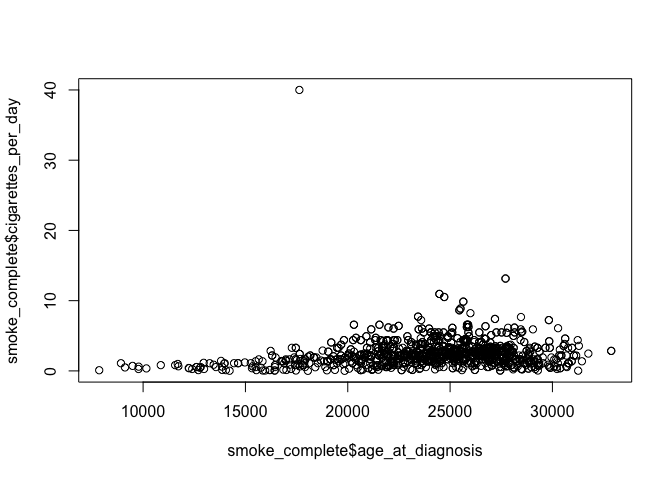
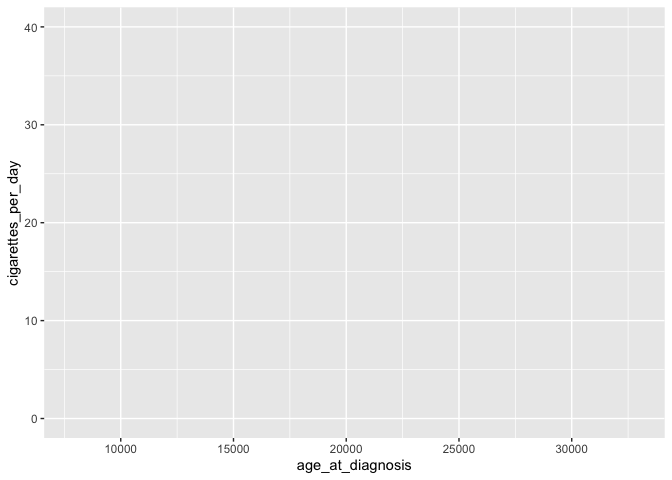
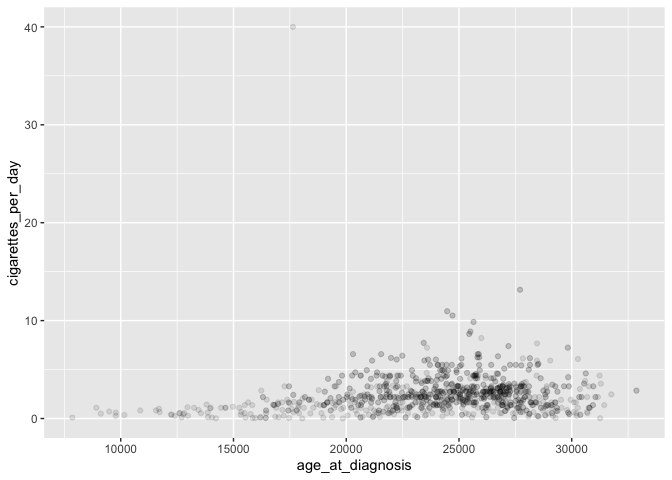
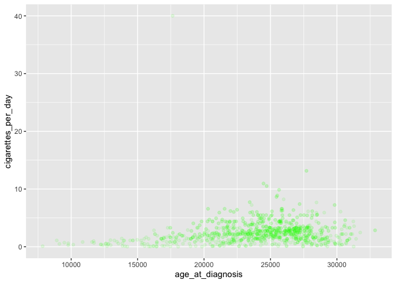
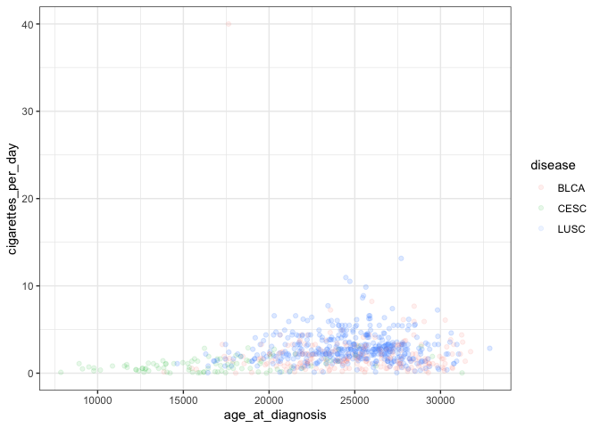
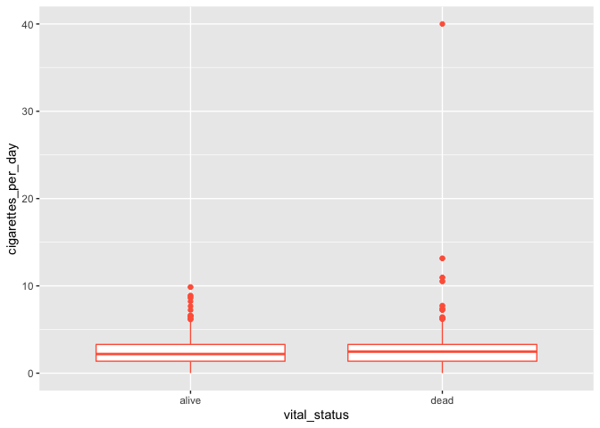

Week 4: Data Visualization
================

## Objectives

So far in this course, we have:

  - learned basic R syntax, including working with objects and functions
  - imported data into R for manipulation with base R methods
  - loaded `tidyverse` and used its data science tools to manipulate and
    filter data

This last session continues our explorations of tidyverse with a
specific focus on data visualization. By the end of today’s session, you
should be able to use `ggplot2` in R to:

  - create and modify scatterplots and boxplots
  - represent time series data as line plots
  - split figures into multiple panels
  - customize your plots

## Getting set up

Since we are continuing to work with data in `tidyverse`, we need to
make sure all of our data and packages are available for use.

Open your project in RStudio. Create a new script called `week4.R` and
enter the following code with comments:

``` r
# load library
library(tidyverse)
```

    ## ── Attaching packages ──────────────────────────────────────────────────────── tidyverse 1.3.0 ──

    ## ✓ ggplot2 3.2.1     ✓ purrr   0.3.3
    ## ✓ tibble  2.1.3     ✓ dplyr   0.8.3
    ## ✓ tidyr   1.0.0     ✓ stringr 1.4.0
    ## ✓ readr   1.3.1     ✓ forcats 0.4.0

    ## ── Conflicts ─────────────────────────────────────────────────────────── tidyverse_conflicts() ──
    ## x dplyr::filter() masks stats::filter()
    ## x dplyr::lag()    masks stats::lag()

``` r
# read in first filtered data from last week
birth_reduced <- read_csv("data/birth_reduced.csv")
```

    ## Parsed with column specification:
    ## cols(
    ##   .default = col_character(),
    ##   age_at_diagnosis = col_double(),
    ##   days_to_death = col_double(),
    ##   days_to_birth = col_double(),
    ##   days_to_last_follow_up = col_double(),
    ##   cigarettes_per_day = col_double(),
    ##   years_smoked = col_double(),
    ##   year_of_birth = col_double(),
    ##   year_of_death = col_double()
    ## )

    ## See spec(...) for full column specifications.

``` r
# read in second filtered data from last week
smoke_complete <- read_csv("data/smoke_complete.csv")
```

    ## Parsed with column specification:
    ## cols(
    ##   .default = col_character(),
    ##   age_at_diagnosis = col_double(),
    ##   days_to_death = col_double(),
    ##   days_to_birth = col_double(),
    ##   days_to_last_follow_up = col_double(),
    ##   cigarettes_per_day = col_double(),
    ##   years_smoked = col_double(),
    ##   year_of_birth = col_double(),
    ##   year_of_death = col_double()
    ## )
    ## See spec(...) for full column specifications.

If you have trouble accessing your data and see an error indicating the
file is not found, it is likely one of the following problems:

1.  Check to make sure your project is open in RStudio. You should see
    the path to your project directory (e.g., `~/Desktop/introR`) appear
    at the top of the console (above the window showing output). If this
    doesn’t appear, you should save your script in your project
    directory, then go to `File -> Open Project`. Navigate to the
    location of your project directory and open the folder, then try to
    reexecute your code.
2.  Make sure you have the two datasets (`birth_reduced.csv` and
    `smoke_complete.csv`) in your `data` directory. Please reference the
    materials from week 3 to filter the original clinical dataset and
    export these data.

Once your data are imported appropriately, we can prepare for
visualization:

``` r
# create directory for output
dir.create("figures")
```

    ## Warning in dir.create("figures"): 'figures' already exists

``` r
# simple plot from base R from the smoke_complete dataset
plot(x=smoke_complete$age_at_diagnosis, y=smoke_complete$cigarettes_per_day)
```

<!-- -->

This plot is from base R. It gives you a general idea about the data,
but isn’t very aesthetically pleasing. Our work today will focus on
developing more refined plots using `ggplot2`, which is part of the
`tidyverse`.

## Intro to ggplot2 and scatterplots

There are three steps to creating a ggplot. We’ll start with a
scatterplot, which is used to compare quantitative (continuous)
variables.

1.  bind data: create a new plot with a designated dataset

<!-- end list -->

``` r
# basic ggplot
ggplot(data = smoke_complete) # bind data to plot
```

<!-- -->

The last line of code creates an empty plot, since we didn’t include any
instructions for how to present the data.

2.  specify the aesthetic: maps the data to axes on a plot

<!-- end list -->

``` r
# basic ggplot
ggplot(data = smoke_complete, aes(x = age_at_diagnosis, 
                           y = cigarettes_per_day)) # specify aesthetics (axes)
```

<!-- -->

This adds labels to the axis, but no data appear because we haven’t
specified how they should be represented

3.  add layers: visual representation of plot, including ways through
    which data are represented (geometries or shapes) and themes
    (anything not the data, like fonts)

<!-- end list -->

``` r
ggplot(data = smoke_complete,
       mapping = aes(x = age_at_diagnosis, y = cigarettes_per_day)) + 
  geom_point() # add a layer of geometry
```

<!-- -->

The plus sign (`+`) is used here to connect parts of `ggplot` code
together. The line breaks and indentation used here represents the
convention for `ggplot`, which makes the code more readible and easy to
modify.

In the code above, note that we don’t need to include the labels for
`data =` and `mapping =`. It’s also common to include the mapping
(`aes`) in the `geom`, which allows for more flexibility in customizing
(we’ll get to this later\!).

``` r
ggplot(smoke_complete) + 
  geom_point(aes(x = age_at_diagnosis, y = cigarettes_per_day)) 
```

<!-- -->

This plot is identical to the previous plot, despite the differences in
code.

## Customizing plots

Now that we have the data generally displayed the way we’d like, we can
start to customize a plot.

``` r
# add transparency with alpha
ggplot(smoke_complete) +
  geom_point(aes(x = age_at_diagnosis, y = cigarettes_per_day), alpha = 0.1)
```

<!-- -->

Transparency is useful to help see the distribution of data, especially
when points are overlapping.

``` r
# change color of points
ggplot(smoke_complete) +
  geom_point(aes(x = age_at_diagnosis, y = cigarettes_per_day), alpha = 0.1, color = "green")
```

<!-- -->

For more information on colors available, look
[here](http://sape.inf.usi.ch/quick-reference/ggplot2/colour).

We can also color points based on another (usually categorical)
variable:

``` r
ggplot(smoke_complete) +
  geom_point(aes(x = age_at_diagnosis, y = cigarettes_per_day, color = disease), alpha = 0.1)
```

<!-- -->

This automatically adds a legend as well. Why don’t we need to include
quotation marks around `disease`?

We can also change the general appearance of the plot (background colors
and fonts):

``` r
# change background theme
ggplot(smoke_complete) +
  geom_point(aes(x = age_at_diagnosis, y = cigarettes_per_day, color = disease), alpha = 0.1) +
  theme_bw()
```

<!-- -->

This adds another layer to our plot representing a black and white
theme. A complete list of pre-set themes is available
[here](https://ggplot2.tidyverse.org/reference/ggtheme.html), and we’ll
cover ways to customize our own themes later in this lesson.

While the axes are currently sufficient, they aren’t particularly
attractive. We can add a title and replace the axis labels using `labs`:

``` r
# add title and custom axis labels
ggplot(smoke_complete) +
  geom_point(aes(x = age_at_diagnosis, y = cigarettes_per_day, color = disease), alpha = 0.1) +
  labs(title = "Age at diagnosis vs cigarettes per day", # title
       x="age (days)", # x axis label
       y="cigarettes per day") +# y axis label
  theme_bw()
```

<!-- -->

After you’re satisfied with a plot, it’s likely you’d want to share it
with other people or include in a manuscript or report.

``` r
# save plot to file
ggsave("figures/awesomePlot.jpg", width = 10, height = 10, dpi = 300)
```

You can view your `figures/` directory to see the exported jpeg file.
This command interprets the file format for export using the file suffix
you specify. The other arguments dictate the size (`width` and `height`)
and resolution (`dpi`).

**Challenge:** Create a scatterplot showing age at diagnosis vs years
smoked with points colored by gender and appropriate axis labels
(solutions to Challenge exercises are available
[here](https://github.com/fredhutchio/R_intro/blob/master/solutions/week4_solutions.R))

## Box and whisker plots

Box and whisker plots compare the distribution of a quantitative
variable among categories.

``` r
# creating a box and whisker plot
ggplot(smoke_complete) +
  geom_boxplot(aes(x=vital_status, y=cigarettes_per_day))
```

<!-- -->

The main differences from the scatterplots we created earlier are the
`geom` type and the variables plotted.

We can change the color similarly to scatterplots:

``` r
# adding color
ggplot(smoke_complete,
       aes(x=vital_status, y=cigarettes_per_day)) +
  geom_boxplot(aes(x=vital_status, y=cigarettes_per_day), color="tomato")
```

<!-- -->

It seems weird to change the color of the entire box, though. A better
option would be to add colored points to a black box and whisker plot:

``` r
# adding colored points to black box and whisker plot
ggplot(smoke_complete) +
  geom_boxplot(aes(x=vital_status, y=cigarettes_per_day)) +
  geom_jitter(aes(x=vital_status, y=cigarettes_per_day), alpha = 0.3, color = "blue")
```

<!-- -->

This plots the points on top of the original boxplot. Jitter references

Option that eliminates duplicates

**Challenge:** Write code comments for each of the following lines of
code. What is the advantage of writing code like
this?

``` r
my_plot <- ggplot(smoke_complete, aes(x=vital_status, y=cigarettes_per_day)) 
my_plot +
  geom_boxplot() +
  geom_jitter(alpha = 0.2, color = "purple")
```

<!-- -->

Documentation for all `ggplot` features is available
[here](https://ggplot2.tidyverse.org). RStudio also publishes a [ggplot
cheat
sheet](https://github.com/rstudio/cheatsheets/raw/master/data-visualization-2.1.pdf)
that is really handy\!
